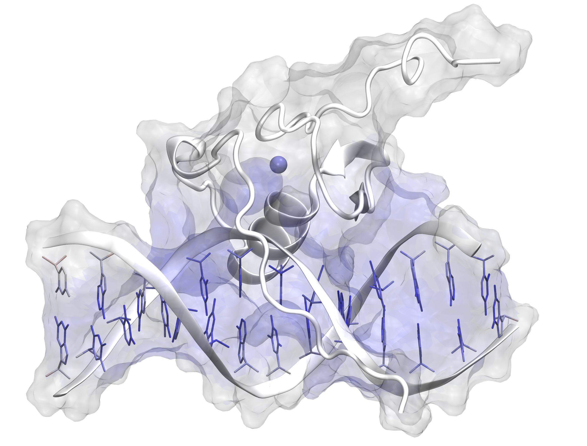

IEDA Documentation
==================

IEDA is a tool for analyzing, quantifying, and visualizing intermolecular electronic density (IED) in biomolecular systems. 
The methodology uses quantum approaches derived from Mulliken overlap populations and orbital-based (OB), allowing the 
identification of regions where there is electron sharing between non-covalently bonded molecules, such as in hydrogen bonds. 
The goal of IEDA is to provide an electronic descriptor capable of assisting in the study of binding affinity, molecular recognition, 
and detailed analysis of intermolecular interactions in computational models and experimental data.
The goal of IEDA is to provide an electronic descriptor to assist in:

- Binding affinity analysis
- Molecular recognition
- Intermolecular interaction studies

----

.. toctree::
   :maxdepth: 2
   :caption: Getting Started

   getting_started

.. toctree::
   :maxdepth: 2
   :caption: User Guide

   tutorial/quickstart

.. toctree::
   :maxdepth: 2
   :caption: Theory

   theory/overview

.. toctree::
   :maxdepth: 2
   :caption: API
   
   api/modules
   
   ieda
